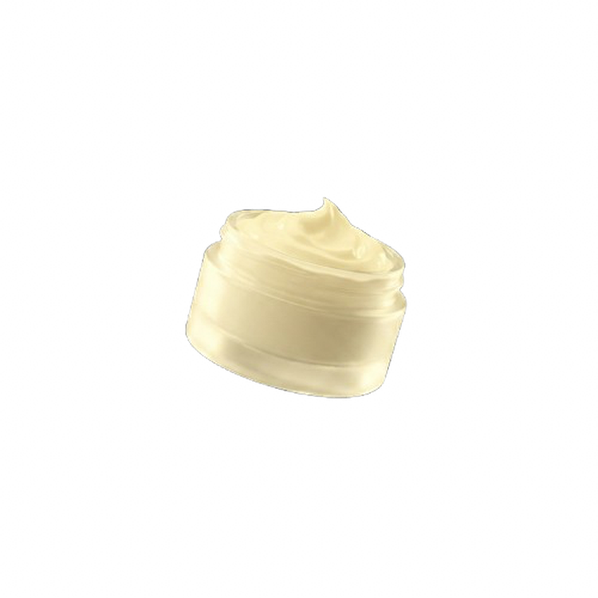

# Guide : Badge produit style HIMS (image flottante + ombre elliptique)

## Principe

Chaque badge quiz affiche un produit PNG transparent qui "flotte" sur le fond beige du badge. Une ombre elliptique au sol donne l'effet de levitation. Au hover, le fond du badge change de couleur et le produit s'adapte visuellement.

---

## Etape 1 : Creer l'image PNG transparente

L'image produit doit etre en **PNG avec fond transparent (RGBA)**.

```bash
pip install "rembg[cpu]" pillow
```

```python
from rembg import remove
from PIL import Image
import io

with open('mon-image-source.jpg', 'rb') as f:
    input_data = f.read()

output_data = remove(input_data)

img = Image.open(io.BytesIO(output_data))
img.save('mon-produit.png', 'PNG')
```

Verifier que le mode est bien **RGBA** (pas RGB) :

```python
img = Image.open('mon-produit.png')
print(img.mode)  # Doit afficher "RGBA"
```

> Si le mode est RGB, le fond n'est pas transparent (damier "faux transparent" bake dans les pixels). Relancer rembg sur l'image.

---

## Etape 2 : CSS

### Zone visuelle (remontee de 24px pour centrage vertical)

```css
.product-feature-visual {
    flex: 1;
    display: flex;
    align-items: center;
    justify-content: center;
    width: 100%;
    margin-top: -24px;
}
```

### Wrapper (porte l'ombre elliptique via ::after)

```css
.product-feature-img-wrap {
    position: relative;
    display: flex;
    align-items: center;
    justify-content: center;
}

.product-feature-img-wrap::after {
    content: '';
    position: absolute;
    bottom: 12%;
    left: 50%;
    transform: translateX(-50%);
    width: 55%;
    height: 12px;
    background: radial-gradient(ellipse at center, rgba(0,0,0,0.22) 0%, transparent 70%);
    border-radius: 50%;
}
```

### Image produit

```css
.product-feature-img {
    width: 140px;
    height: 140px;
    object-fit: contain;
    filter: none;
    transition: transform 250ms cubic-bezier(0.16, 1, 0.3, 1);
    position: relative;
    z-index: 1;
}

.product-feature-card:hover .product-feature-img {
    transform: scale(1.05);
}

@media (min-width: 1024px) {
    .product-feature-img {
        width: 220px;
        height: 220px;
    }

    .product-feature-img-wrap::after {
        height: 16px;
    }
}
```

### Badge (fond plat, couleur au hover)

```css
.product-feature-card {
    background: var(--beige);  /* Fond plat par defaut */
}

/* Couleur au hover par categorie */
.product-feature-card.card--naturels:hover  { background: #C5D08C; }
.product-feature-card.card--dermo:hover     { background: #9DCCAE; }
.product-feature-card.card--complements:hover { background: #E9B870; }
.product-feature-card.card--medical:hover   { background: #ADA5D7; }
```

---

## Etape 3 : HTML

Remplacer le SVG icon par une image produit dans le badge :

```html
<a href="Quizzes/quiz-soin-peau.html" class="product-feature-card card--dermo">
    <div class="product-feature-header">
        <span class="product-feature-title">Dermo<span class="accent-teal">cosmetique</span></span>
        <span class="product-feature-arrow">
            <svg viewBox="0 0 24 24" fill="none" stroke="currentColor" stroke-width="2">
                <path d="M9 18l6-6-6-6"/>
            </svg>
        </span>
    </div>
    <div class="product-feature-visual">
        <div class="product-feature-img-wrap">
            
        </div>
    </div>
</a>
```

---

## Badges actuellement mis a jour

| Badge | Image | Fichier |
|---|---|---|
| Dermocosmetique | Pot de creme jaune | `images/dermocosmetique-product.png` |
| Automedication | Pilules flottantes | `images/automedication-product.png` |
| Produits naturels | SVG icon (a remplacer) | — |
| Complements alimentaires | SVG icon (a remplacer) | — |

---

## Resume

| Element | Technique |
|---|---|
| Fond transparent | `rembg` Python → PNG RGBA |
| Ombre au sol | `::after` pseudo-element avec `radial-gradient` elliptique |
| Taille image | 140px mobile / 220px desktop |
| Position ombre | `bottom: 12%` du wrapper |
| Remontee visuelle | `margin-top: -24px` sur `.product-feature-visual` |
| Hover produit | `scale(1.05)` |
| Hover badge | Fond passe de beige → couleur categorie |
