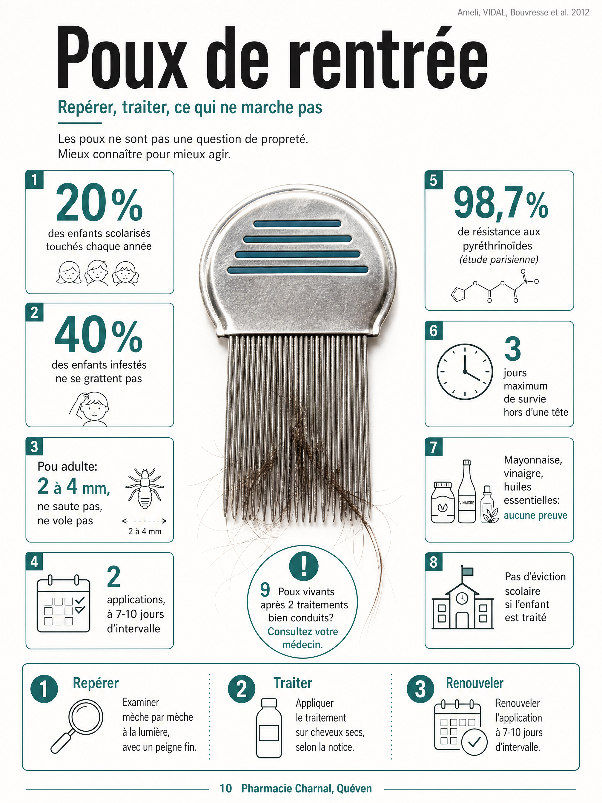

**L'essentiel en 3 points:**
- Jusqu'à 20% des enfants scolarisés sont touchés chaque année, surtout entre 3 et 10 ans, et environ 40% des têtes infestées ne provoquent aucune démangeaison (Ameli, 2025)
- Le traitement de référence en pharmacie est une lotion à action physique (diméticone), appliquée deux fois, à sept ou dix jours d'intervalle
- Seules les têtes où un pou vivant a été vu doivent être traitées, le même jour: traiter toute la famille par précaution a longtemps entretenu la résistance des poux aux anciens traitements

---

# Poux de rentrée: les repérer, les traiter, ce qui ne marche pas

Un mercredi soir de septembre. Le mot de l'école, plié en quatre au fond du cartable, ressort au moment du bain. Le réflexe classique: foncer au rayon parapharmacie, prendre le produit qui promet d'agir en une seule application, traiter toute la maison le soir même. Personne n'a encore regardé la tête.

Dans les écoles de Quéven comme partout ailleurs, ce mot revient chaque année en septembre et octobre, dès que les classes se mélangent à la cantine et à la récréation. La question qu'on pose toujours en premier, chez nous: avez-vous vu un pou vivant, ou seulement lu le mot?

## Comment repérer un pou vivant sur la tête de mon enfant?

Un pou adulte mesure 2 à 4 mm, ne saute pas et ne vole pas: il se déplace uniquement de cheveu en cheveu, par contact direct (Ameli, 2025). Environ 40% des enfants infestés ne se grattent pas du tout. Le seul diagnostic fiable est le peignage à la lumière, nuque et derrière les oreilles, pas le mot photocopié de l'école.

Le geste qui tranche: pincer ce qu'on voit collé au cheveu. Une lente vivante ne coulisse pas, elle est soudée près de la racine par une sorte de ciment naturel. Une pellicule, elle, part au moindre souffle. Une femelle pond 5 à 10 œufs par jour pendant 20 à 30 jours, soit 100 à 300 œufs sur sa vie. Les lentes éclosent en 7 à 10 jours, l'adulte est formé en 10 à 15 jours de plus. Le pic de consultations arrive typiquement dix à quinze jours après la rentrée: le temps que les premiers poux transmis dans la cour se reproduisent et que leurs œufs éclosent à leur tour.

## Qui faut-il traiter dans la famille?

La règle est la même pour la Société Française de Dermatologie (communiqué du 4 novembre 2019), le VIDAL et le Conseil supérieur d'hygiène publique: on inspecte toutes les têtes du foyer, mais on ne traite que celles où un pou vivant a été vu, le même jour. Traiter une tête où aucun pou n'a été vu ne sert à rien: le produit élimine les poux déjà présents, il ne protège pas contre une contamination future.

Ce réflexe a un coût mesuré. Les insecticides classiques de la famille des pyréthrinoïdes (dont la perméthrine) ont perdu une large partie de leur efficacité en France: une étude sur 670 poux parisiens a retrouvé la mutation de résistance dans 98,7% des cas (Bouvresse et al., *J Am Acad Dermatol*, 2012). Prioderm, une lotion à base de malathion, a de son côté été retirée du marché français par l'ANSM fin 2018, pour une raison différente: un renforcement des conditions de prescription après des effets indésirables neurologiques rares mais préoccupants chez l'enfant.

## Quel traitement choisir en pharmacie?

Le premier choix recommandé aujourd'hui (Prescrire, VIDAL, Ameli) est une lotion à base de diméticone, un silicone qui agit par blocage physique des voies respiratoires du pou, sans neurotoxique. Nous proposons plusieurs références dans cette famille, notamment Pouxit et Biogaran Soin Traitant Anti-Poux. La résistance y est jugée peu probable, contrairement aux pyréthrinoïdes, à condition de respecter le temps de pose: les formules à application très courte (cinq minutes) sont moins bien documentées sur ce point (Burgess, *Pharmaceutics*, 2022).

Trois points à respecter pour que ça marche:

- Application sur cheveux **secs**, en suivant le temps de pose indiqué sur la notice (il varie fortement d'un produit à l'autre)
- **Deux applications obligatoires**, à sept ou dix jours d'intervalle: la première tue les poux vivants, la seconde rattrape ceux qui viennent d'éclore
- Peigne à dents métalliques serrées après chaque rinçage, en complément, jamais seul: utilisé sans lotion, il n'élimine qu'environ un pou sur deux (Ameli)

Les essais cliniques européens situent l'efficacité d'une lotion diméticone autour de 70% (Burgess et al., *BMJ*, 2005), ce qui explique pourquoi la seconde application n'est pas facultative. Contrôlez à deux jours après cette seconde pose: si des poux vivants sont encore là après deux traitements bien conduits, direction le [médecin traitant](https://www.pharmaciecharnal.com/blog/professionnels-sante-queven-2026.html) plutôt qu'un troisième flacon du même type.

---

**Une question sur le bon produit pour votre enfant?**
Passez nous voir, nous prenons le temps de vérifier avec vous le temps de pose indiqué sur la notice du flacon que vous avez en main.
32 Place de Toulouse, Quéven

---

## Le vinaigre, la mayonnaise, les huiles essentielles: est-ce que ça marche?

Certains remèdes de grand-mère ont la vie dure, mais ils n'ont jamais fait leurs preuves. Aucune étude ne soutient la mayonnaise, l'huile, le beurre ou la vaseline contre les poux (CDC, 2024; Takano-Lee et al., 2004). Le vinaigre ne tue pas les poux, il peut tout au plus aider à décoller les lentes avant le peignage. Les huiles essentielles n'ont pas d'efficacité démontrée et sont contre-indiquées chez l'enfant et pendant la grossesse (Ameli; NICE; American Academy of Pediatrics, 2022).

Le problème de ces méthodes n'est pas seulement qu'elles ne marchent pas. Le temps passé dessus, souvent une nuit entière sous bonnet de douche, laisse les lentes éclore tranquillement pendant que la classe continue de se contaminer. La Société Française de Dermatologie a mis en garde, dans son communiqué de 2019, contre un marché de produits et de prestations anti-poux qui échappe largement à l'évaluation sérieuse.

Trois méthodes maison qui ne marchent pas

D'après le CDC, Ameli et l'étude Takano-Lee (2004)

<svg width="22" height="22" viewBox="0 0 24 24" fill="none" stroke="currentColor" stroke-width="2" stroke-linecap="round" stroke-linejoin="round"><path d="M12 3c4 0 8 2.5 8 6 0 1-1 2-2 2H6c-1 0-2-1-2-2 0-3.5 4-6 8-6z"/><path d="M12 11v8"/><path d="M9 19h6"/></svg>

Mayonnaise, bonnet toute la nuit

Aucune preuve d'efficacité

Idem pour l'huile, le beurre et la vaseline. Une nuit perdue pendant que les lentes éclosent.

<svg width="22" height="22" viewBox="0 0 24 24" fill="none" stroke="currentColor" stroke-width="2" stroke-linecap="round" stroke-linejoin="round"><path d="M12 3c4 0 8 2.5 8 6 0 1-1 2-2 2H6c-1 0-2-1-2-2 0-3.5 4-6 8-6z"/><path d="M12 11v8"/><path d="M9 19h6"/></svg>

Vinaigre

Ne tue pas les poux

Aide tout au plus à décoller les lentes avant le passage du peigne, rien de plus.

<svg width="22" height="22" viewBox="0 0 24 24" fill="none" stroke="currentColor" stroke-width="2" stroke-linecap="round" stroke-linejoin="round"><path d="M12 3c4 0 8 2.5 8 6 0 1-1 2-2 2H6c-1 0-2-1-2-2 0-3.5 4-6 8-6z"/><path d="M12 11v8"/><path d="M9 19h6"/></svg>

Huiles essentielles

Efficacité non démontrée, contre-indiquées

Chez l'enfant et pendant la grossesse, l'allergie est un risque réel pour un bénéfice non prouvé.

Le seul geste utile en complément d'un traitement: le peigne à dents métalliques.

## Faut-il évincer mon enfant de l'école?

Non. Ameli est claire: les poux ne justifient pas d'éviction scolaire, sauf en cas de surinfection cutanée (impétigo), une règle qui s'appuie sur un avis du Conseil supérieur d'hygiène publique de France de 2003. Un enfant traité peut retourner en classe normalement.

Les poux touchent toutes les catégories sociales. Ils ne sont pas un signe de manque d'hygiène. Ils se transmettent par contact direct, cheveu à cheveu, parfois via une brosse ou un bonnet partagé, indépendamment de la propreté du foyer. Le seul geste préventif reconnu reste simple: cheveux longs attachés, pas d'échange de bonnets ni de brosses, et un coup d'œil régulier au peigne pendant les périodes à risque.

## Ça gratte encore après le traitement: faut-il s'inquiéter?

Des démangeaisons qui persistent plusieurs jours après un traitement bien conduit ne signifient pas qu'il a échoué. C'est le vrai piège du deuxième passage en pharmacie: le prurit peut survivre au pou. Le repère le plus fiable reste le contrôle à deux jours après la seconde application.

Deux repères simples pour trancher. Des poux vivants retrouvés deux jours après la seconde application, c'est un échec réel, qui justifie un avis médical. Des lentes vides et collées, encore visibles des semaines plus tard, ne veulent pas dire que l'infestation est active: elles peuvent rester accrochées au cheveu pendant des mois après un traitement efficace. Deux précautions à connaître avant d'appliquer une lotion: elle est contre-indiquée en spray chez l'enfant asthmatique (préférer la lotion), et les diméticones sont inflammables, à tenir éloignées d'une flamme, d'une plaque ou d'un sèche-cheveux pendant le temps de pose.

## L'essentiel à retenir

| Situation | Le bon geste | Qui consulter |
|---|---|---|
| Pou vivant vu sur une tête | Lotion diméticone + peigne métal, 2 applications à J0 et J+7/10 | Votre pharmacien |
| Mot de l'école, aucun pou vu | Peignage minutieux à la lumière avant tout traitement | Votre pharmacien |
| Poux vivants encore présents 2 jours après le 2e traitement | Ne pas répéter le même produit | [Médecin traitant](https://www.pharmaciecharnal.com/blog/professionnels-sante-queven-2026.html) |
| Enfant asthmatique ou nourrisson | Pas de spray; peigne quotidien pendant 2 semaines pour les tout-petits | Votre pharmacien |

Un enfant avec des poux n'a rien fait de mal, et sa famille non plus. **La seule chose qui compte vraiment: vérifier qu'il s'agit bien d'un pou vivant avant de traiter, et refaire la seconde application sept à dix jours plus tard, même si tout semble déjà réglé.**

**Bon courage pour le peignage, ça se termine toujours par tomber sur quelqu'un.**

---

*Votre équipe officinale*

---

## Questions fréquentes

**Combien de temps un pou peut-il survivre loin d'une tête?**
Trois jours maximum (Ameli, 2025). Inutile de laver toute la maison: seul ce qui a touché le cuir chevelu dans les trois derniers jours mérite un lavage à plus de 50°C, ou trois jours dans un sac fermé pour ce qui ne passe pas en machine.

**Faut-il traiter toute la famille par précaution?**
Non. La Société Française de Dermatologie et le VIDAL recommandent d'inspecter toutes les têtes du foyer, mais de ne traiter que celles où un pou vivant a été vu, le même jour. Traiter sans preuve n'ajoute aucune protection, et ce réflexe a probablement contribué, par le passé, à la résistance des poux aux anciens traitements.

**Les huiles essentielles anti-poux sont-elles efficaces?**
Leur efficacité n'est pas démontrée, et elles sont contre-indiquées chez l'enfant et pendant la grossesse (Ameli, NICE, American Academy of Pediatrics, 2022), en raison notamment du risque allergique. Aucun traitement préventif contre les poux n'est reconnu à ce jour: le seul geste utile reste la surveillance régulière au peigne.

**Pourquoi ça démange encore après le traitement?**
Le prurit peut persister plusieurs jours après un traitement efficace, le temps que la peau irritée cicatrise. Un vrai échec se reconnaît à la présence de poux vivants deux jours après la seconde application, jamais aux seules démangeaisons, qui ne justifient pas à elles seules un nouveau traitement.

**Mon enfant peut-il aller à l'école avec des poux?**
Oui, dès lors qu'il est traité. Ameli est claire sur ce point: pas d'éviction scolaire pour une pédiculose traitée, sauf en cas de surinfection cutanée comme l'impétigo. Prévenir l'école reste utile, pour que les autres familles pensent aussi à vérifier les têtes de leurs enfants.

**Quel est le traitement de référence en pharmacie aujourd'hui?**
Une lotion à base de diméticone, à action physique, en deux applications espacées de sept à dix jours, complétée par un peigne à dents métalliques. Les insecticides comme la perméthrine restent disponibles, mais leur efficacité a beaucoup baissé face aux résistances, d'où la préférence actuelle pour l'action physique.

---

**Références:**

1. Ameli (Assurance Maladie), dossier *Poux*, 25 juin 2025.
2. VIDAL, *Les traitements contre les poux*, 25 août 2025.
3. Société Française de Dermatologie (SFD) / GR-IDIST, communiqué du 4 novembre 2019, Pr Olivier Chosidow.
4. Bouvresse S. et al. Permethrin and malathion resistance in head lice: results of ex vivo and molecular assays. *J Am Acad Dermatol*. 2012;67:1143-1150.
5. Burgess IF, Brown CM, Lee PN. Treatment of head louse infestation with 4% dimeticone lotion: randomised controlled equivalence trial. *BMJ*. 2005;330:1423.
6. Burgess IF. Physically acting treatments for head lice, can we still claim they are resistance proof? *Pharmaceutics*. 2022;14(11):2430.
7. Centers for Disease Control and Prevention (CDC), *Treatment of Head Lice*, 12 novembre 2024.
8. Prescrire, *Pédiculose du cuir chevelu*, mai 2019.
9. ANSM, arrêt de commercialisation de la lotion anti-poux Prioderm (malathion), décembre 2018.
10. Conseil supérieur d'hygiène publique de France (CSHPF/HCSP), avis du 27 juin 2003 relatif à la conduite à tenir devant un sujet atteint de pédiculose.
11. Pouxit (laboratoires Cooper), fiches produits Pouxit, Pouxit XF, Pouxit Flash, composition diméticone.
12. Biogaran, Soin traitant anti-poux Biogaran Conseil / Kids, composition diméticone.
