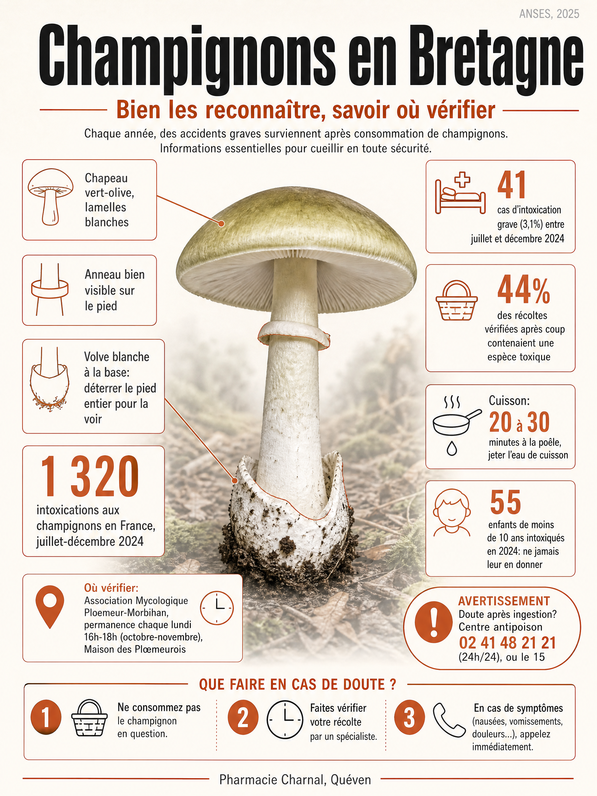

**L'essentiel en 3 points:**
- Entre juillet et décembre 2024, 1 320 personnes se sont intoxiquées en France lors d'un repas de champignons, avec un pic en octobre et 3 décès (ANSES, 2025)
- La confusion la plus dangereuse: jeune, l'amanite phalloïde ressemble à une coulemelle, et ses premiers symptômes n'apparaissent que 6 à 24 heures après le repas
- La bonne adresse dans le Morbihan: l'Association Mycologique Ploemeur-Morbihan tient une permanence de détermination chaque lundi d'octobre et novembre, une pharmacie n'identifie pas les champignons

---

# Champignons en Bretagne: bien les reconnaître et savoir où faire vérifier sa récolte

Mi-octobre, forêt de Camors. Le sous-bois est détrempé par la pluie du week-end, exactement ce qu'il faut pour les girolles. La semaine dernière, une cliente est passée nous montrer son panier en pharmacie: de belles girolles, quelques cèpes, et deux ou trois champignons qu'elle n'arrivait pas à nommer.

Notre réponse a été honnête. Nous ne sommes pas formées à la mycologie et nous ne pouvons pas garantir l'identification d'une récolte sur cette seule base. Ce n'est pas un détail: une confusion peut coûter cher. Voici où nous l'avons orientée, et ce que nous conseillons à quiconque revient de la forêt avec un panier plein.

## Quand ramasser les champignons en Bretagne?

En Bretagne, la cueillette s'étale de la fin du printemps aux premières gelées, mais le vrai pic se situe en octobre: c'est le mois où les centres antipoison enregistrent le plus d'intoxications chaque année, saison 2024 comprise (ANSES, 2025). Une pluie modérée suivie de journées ensoleillées fait sortir les espèces recherchées en quelques jours.

Les cèpes et les bolets dominent en général de fin août à début octobre. À partir de la deuxième semaine d'octobre et jusqu'à mi-décembre, ce sont les girolles et les chanterelles qui prennent le relais: c'était déjà le cas en 2024, où elles sont devenues les champignons les plus recherchés de la saison, devant les cèpes de 2023. Les trompettes de la mort et les pieds de mouton suivent, plutôt en fin de saison, jusqu'aux premières gelées.

## Quels champignons comestibles trouve-t-on en Morbihan?

Le Morbihan compte plusieurs forêts domaniales réputées pour la cueillette: Camors et Pontcallec en accès libre, Quénécan et Lanouée sur permis payant (environ 25 euros par an).

- **Cèpes** (*Boletus edulis*) et bolets jaunes, de fin août à octobre
- **Girolles et chanterelles** (*Cantharellus*), d'octobre à décembre
- **Trompettes de la mort** (*Craterellus cornucopioides*), en fin de saison
- **Pieds de mouton** (*Hydnum repandum*), reconnaissables à leurs aiguillons sous le chapeau
- **Coulemelles ou lépiotes élevées** (*Macrolepiota procera*), l'une des espèces les plus souvent confondues avec un champignon toxique (voir plus bas)

## Comment reconnaître l'amanite phalloïde, la plus dangereuse?

L'amanite phalloïde (*Amanita phalloides*) est la cause la plus fréquente des intoxications mortelles aux champignons en France, via le syndrome phalloïdien qui porte son nom (VIDAL, MSD Manuals). En 2024, les trois décès enregistrés par les centres antipoison relevaient tous de ce syndrome (ANSES, 2025): l'espèce n'a pu être confirmée pour aucun des trois cas, l'un des patients ayant probablement consommé une galère marginée (*Galerina marginata*), une autre espèce à amatoxines, en la prenant pour une pholiote changeante comestible. L'amanite phalloïde pousse surtout sous les chênes, avec un chapeau vert-olive à jaunâtre, des lames blanches, un anneau membraneux et une volve en forme de sac à la base du pied.

Cette volve est souvent enterrée: il faut déterrer le pied en entier pour la voir, jamais couper le champignon au ras du sol. Chez les jeunes spécimens, l'anneau peut ne pas encore être visible et la volve peut passer inaperçue, ce qui explique la confusion avec la coulemelle ou la lépiote. Dans les récoltes vérifiées après coup par un mycologue en 2024, c'est justement de l'amanite phalloïde et de la lépiote vénéneuse qu'on retrouvait chez des cueilleurs partis chercher des coulemelles.

**Attention:** le vrai danger de l'amanite phalloïde, c'est le délai. Les premiers symptômes digestifs n'apparaissent que 6 à 24 heures après le repas, parfois plus tard. Cette accalmie trompeuse retarde la prise en charge alors que le foie est déjà attaqué. Toute gêne digestive qui survient plusieurs heures après un repas de champignons est une urgence, pas un simple embarras gastrique.

## Pourquoi tant d'intoxications chaque automne?

Entre le 1er juillet et le 31 décembre 2024, 1 320 personnes se sont intoxiquées en France lors d'un repas de champignons, dont 41 cas (3,1%) de gravité forte (ANSES, 2025). La cause la plus fréquente: une identification insuffisante avant de passer à table.

Dans cette étude, la cueillette n'avait été identifiée avant consommation que dans un peu plus d'un quart des repas (27,3%). Quand un mycologue vérifiait après coup une photographie prise par le consommateur, il retrouvait une ou plusieurs espèces toxiques dans 44% des récoltes, même chez des cueilleurs convaincus de bien connaître leur sujet.

Les enfants payent un tribut disproportionné: 55 enfants de moins de 10 ans ont été intoxiqués en 2024 en mangeant des champignons cueillis par leur entourage. La règle est simple et non négociable: on ne donne jamais de champignons sauvages à un jeune enfant.

Les confusions qui reviennent le plus souvent

D'après les récoltes vérifiées par un mycologue en 2024 (ANSES)

<svg width="22" height="22" viewBox="0 0 24 24" fill="none" stroke="currentColor" stroke-width="2" stroke-linecap="round" stroke-linejoin="round"><path d="M12 3c4 0 8 2.5 8 6 0 1-1 2-2 2H6c-1 0-2-1-2-2 0-3.5 4-6 8-6z"/><path d="M12 11v8"/><path d="M9 19h6"/></svg>

Cherché: coulemelle

Trouvé: lépiote vénéneuse ou amanite phalloïde

Jeunes, ces deux espèces toxiques ressemblent à la coulemelle avant que l'anneau ou la volve ne soient bien visibles. La confusion la plus dangereuse.

<svg width="22" height="22" viewBox="0 0 24 24" fill="none" stroke="currentColor" stroke-width="2" stroke-linecap="round" stroke-linejoin="round"><path d="M12 3c4 0 8 2.5 8 6 0 1-1 2-2 2H6c-1 0-2-1-2-2 0-3.5 4-6 8-6z"/><path d="M12 11v8"/><path d="M9 19h6"/></svg>

Cherché: girolle

Trouvé: clitocybe de l'olivier

Orange comme la girolle, il pousse en touffes au pied des souches et provoque un syndrome digestif sévère.

<svg width="22" height="22" viewBox="0 0 24 24" fill="none" stroke="currentColor" stroke-width="2" stroke-linecap="round" stroke-linejoin="round"><path d="M12 3c4 0 8 2.5 8 6 0 1-1 2-2 2H6c-1 0-2-1-2-2 0-3.5 4-6 8-6z"/><path d="M12 11v8"/><path d="M9 19h6"/></svg>

Cherché: agaric champêtre

Trouvé: agaric jaunissant

Jaunit et sent l'encre au frottement du pied, contrairement au rosé des prés qu'il imite.

Le nom recherché ne garantit jamais l'espèce réellement cueillie.

## Où faire vérifier sa récolte en Morbihan?

Contrairement à une idée reçue, nous ne proposons pas d'identification mycologique dans notre pharmacie: ce n'est pas une compétence que nous exerçons au quotidien. L'ANSES cite pourtant «certains pharmaciens» parmi les relais possibles, aux côtés des associations de mycologie (ANSES, 2025). Deux adresses fiables existent dans le Morbihan pour lever le doute avant de cuisiner.

L'Association Mycologique Ploemeur-Morbihan tient une permanence de détermination chaque lundi de 16h à 18h à la Maison des Plœmeurois, en octobre et novembre, en pleine saison de cueillette (2 allée des Alouettes, 56270 Ploemeur, mycologiemorbihan.com). C'est le contact le plus proche de Quéven pour faire trancher un panier douteux avant de le faire cuire.

Si vous n'avez pas cette possibilité, l'ANSES est claire sur un point: ne consommez jamais un champignon identifié au moyen d'une application de reconnaissance par photo sur smartphone, «en raison du risque élevé d'erreur» (ANSES, 2025). Le geste recommandé à la place: prendre une photo de votre récolte avant la cuisson. En cas de doute après le repas, cette photo permet à un mycologue du réseau Mycoliste d'identifier rapidement l'espèce en lien avec le centre antipoison.

---

**Un doute sur votre récolte?**
Ne la consommez pas avant d'être sûr. L'Association Mycologique Ploemeur-Morbihan ou le centre antipoison sont les bons interlocuteurs pour trancher, pas nous.
AMPM Ploemeur · Centre antipoison 02 41 48 21 21

---

## Quelles règles respecter pour cueillir sans risque?

La cuisson protège autant que l'identification: en 2024, près d'un repas sur dix contenait des champignons consommés crus, alors que l'ANSES recommande de ne jamais consommer un champignon sauvage cru, et de le cuire au moins 20 à 30 minutes à la poêle ou 15 minutes à l'eau bouillante en jetant l'eau de cuisson (ANSES, 2025).

- Un panier, une caisse ou un carton, jamais un sac plastique: il accélère le pourrissement et complique l'identification
- Cueillez loin des bords de route, des zones industrielles, des décharges et des pâturages: les champignons absorbent les polluants
- Ramassez le champignon entier, pied compris: la base (volve, anneau) est souvent la seule façon de distinguer une espèce dangereuse
- Évitez les jeunes spécimens pas encore formés, qui favorisent les confusions, et les vieux spécimens abîmés
- Séparez les espèces si vous n'êtes pas sûr, pour ne pas contaminer un lot comestible avec un intrus
- Lavez-vous soigneusement les mains après la cueillette
- Conservez au réfrigérateur (maxi 4°C) et consommez dans les deux jours
- Restez raisonnable sur la quantité: 150 à 200 grammes par adulte et par semaine
- Ne donnez jamais de champignons cueillis à un enfant de moins de 10 ans

## Quand faut-il appeler le centre antipoison ou le 15?

Le signal le plus trompeur est le délai: des troubles digestifs qui apparaissent plus de 6 heures après un repas de champignons, même légers, sont plus inquiétants que des symptômes précoces, car ils évoquent le syndrome phalloïdien.

Contactez immédiatement le centre antipoison et de toxicovigilance du Grand Ouest, qui couvre la Bretagne, au **02 41 48 21 21** (24h/24), dès les premiers symptômes ou en cas de doute après ingestion, même sans symptôme. Composez le **15** (SAMU) ou le **112** en cas de vomissements importants, de signes de déshydratation chez un enfant, ou de tout signe neurologique (vertiges, confusion). Emportez si possible les restes du repas ou une photo de la récolte: c'est souvent ce qui permet d'orienter le traitement le plus vite.

## L'essentiel à retenir

| Situation | Le bon geste | Qui consulter |
|---|---|---|
| Récolte avec une espèce non identifiée | Photographier avant cuisson, ne pas consommer en cas de doute | AMPM Ploemeur (permanences oct-nov) |
| Symptômes digestifs dans les 6h suivant le repas | Rester au calme, appeler sans attendre | Centre antipoison Grand Ouest (02 41 48 21 21) |
| Symptômes digestifs après 6h, même légers | Ne jamais temporiser, signal du syndrome phalloïdien | 15 (SAMU) ou 112 en urgence |
| Panier ramené à la maison avec de jeunes enfants | Ne jamais leur donner de champignons sauvages | Votre pharmacien pour toute question |

Un panier de girolles reste l'un des vrais plaisirs de l'automne breton. **La seule règle qui protège vraiment: ne jamais consommer un champignon dont on n'est pas certain à cent pour cent, même s'il ressemble à celui de l'an dernier.**

**Bonne cueillette, et prudence dans les sous-bois.**

---

*Votre équipe officinale*

---

## Questions fréquentes

**Où faire identifier des champignons dans le Morbihan?**
L'Association Mycologique Ploemeur-Morbihan tient une permanence de détermination chaque lundi de 16h à 18h en octobre et novembre, à la Maison des Plœmeurois (mycologiemorbihan.com). C'est le contact le plus proche de Quéven pour faire vérifier un panier avant de le cuisiner.

**Une pharmacie peut-elle identifier mes champignons?**
Pas la nôtre: nous ne proposons pas ce service ici, même si l'ANSES cite «certains pharmaciens» parmi les relais possibles, aux côtés des associations de mycologie. Adressez-vous à l'Association Mycologique Ploemeur-Morbihan ou, en cas de doute après ingestion, au centre antipoison.

**Quel est le vrai danger de l'amanite phalloïde?**
Ses premiers symptômes digestifs n'apparaissent que 6 à 24 heures après le repas, parfois plus tard, pendant que le foie est déjà attaqué. En 2024, les trois décès par intoxication aux champignons en France relevaient tous de ce syndrome phalloïdien (ANSES, 2025).

**Peut-on donner des champignons cueillis à un jeune enfant?**
Non. En 2024, 55 enfants de moins de 10 ans ont été intoxiqués après avoir mangé des champignons cueillis par leur entourage (ANSES, 2025). La règle est de ne jamais leur en proposer, même en petite quantité, y compris des espèces réputées comestibles pour un adulte.

**Faut-il vraiment cuire les champignons au moins 20 minutes?**
Oui. Plusieurs toxines de champignons résistent à une cuisson trop courte, et certaines espèces, toxiques crues, deviennent comestibles bien cuites. L'ANSES recommande 20 à 30 minutes à la poêle ou 15 minutes à l'eau bouillante, en jetant l'eau de cuisson, et de ne jamais consommer un champignon sauvage cru.

**Une application de reconnaissance de champignons est-elle fiable?**
Non, l'ANSES la déconseille explicitement: ces outils, même les plus récents, restent sujets à des erreurs (ANSES, 2025). Le geste recommandé est de photographier chaque champignon avant cuisson, pour permettre une identification par un mycologue en cas de doute.

---

**Références:**

1. ANSES (2025). Surveillance saisonnière des intoxications accidentelles par des champignons en France hexagonale et Corse. Bilan des cas enregistrés par les Centres antipoison entre le 1er juillet et le 31 décembre 2024. Rapport d'étude de toxicovigilance n°2025-VIG-0015.
2. ANSES (2017), saisine n°2015-SA-0180. Avis relatif à une liste de 146 variétés comestibles de champignons cultivés et sauvages.
3. Centre antipoison et de toxicovigilance du Grand Ouest, CHU d'Angers.
4. Association Mycologique Ploemeur-Morbihan (mycologiemorbihan.com).
5. VIDAL, syndrome phalloïdien et intoxication à l'amanite phalloïde.
6. MSD Manuals, intoxication par les champignons: symptômes et prise en charge.
7. Ameli.fr (Assurance Maladie), intoxications alimentaires liées aux champignons.
8. Réseau Mycoliste, identification a posteriori des récoltes suspectées à l'origine d'une intoxication (Bourgeois et al., 2017).
9. Office National des Forêts (ONF), réglementation de la cueillette en forêt domaniale (Quénécan, Lanouée).
