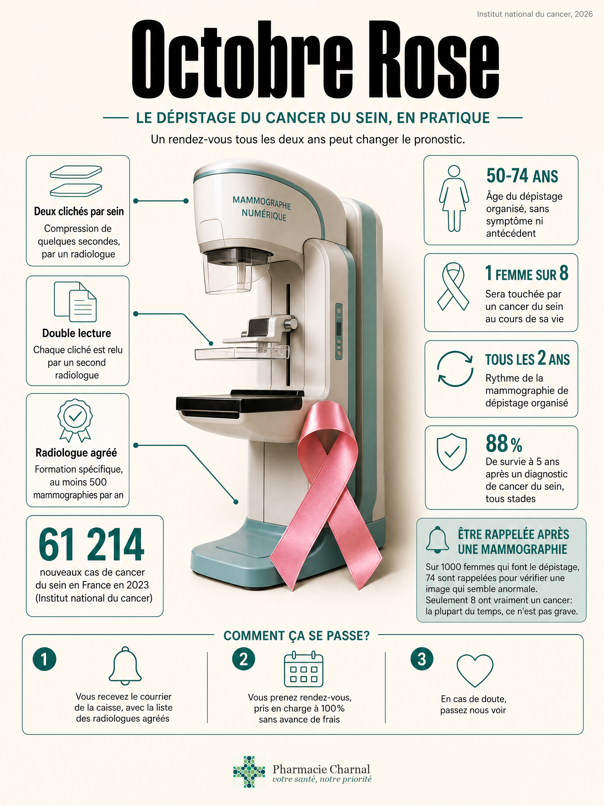

**L'essentiel en 3 points:**
- 61 214 nouveaux cas de cancer du sein et 12 765 décès en France en 2023, environ 1 femme sur 8 concernée au cours de sa vie. Détecté tôt, le pronostic change nettement
- De 50 à 74 ans, une mammographie tous les 2 ans chez un radiologue agréé, sur invitation de l'Assurance Maladie, prise en charge à 100% sans avance de frais
- Nous expliquons le courrier et nous orientons. Nous ne remettons pas de kit pour le sein et nous ne posons pas de diagnostic

---

# Octobre Rose: la mammographie, à quel âge et tous les combien de temps?

Une cliente est passée la semaine dernière chercher son traitement habituel. Elle avait le courrier de la caisse dans son sac depuis trois semaines, sans trop savoir qu'en faire. Elle pensait qu'on allait lui remettre quelque chose, un test à faire chez elle, comme pour le dépistage colorectal en mars.

Ce n'est pas le cas pour le sein. Nous n'avons pas de kit à donner en pharmacie. Un radiologue fait l'examen, pas nous. Ce qu'on peut faire, en revanche: lui expliquer ce que dit le courrier, quelle liste de radiologues consulter, et ce qu'il faut apporter le jour J.

## Pourquoi Octobre Rose nous concerne tous?

Le cancer du sein reste le cancer le plus fréquent et le plus mortel chez les femmes en France: 61 214 nouveaux cas et 12 765 décès en 2023 (Institut national du cancer, mise à jour du 22 juillet 2026). Environ une femme sur huit y sera confrontée au cours de sa vie, huit fois sur dix après 50 ans. Détecté tôt, le pronostic est nettement meilleur: la survie nette à 5 ans, tous stades confondus, est de 88% pour les diagnostics de 2010 à 2015, contre 80% pour la période 1989-1993.

Le mois d'octobre est une campagne de rappel. Un changement au niveau d'un sein se montre à un médecin dès qu'il apparaît, sans attendre le prochain mois d'octobre.

Chez l'homme, la maladie existe aussi, mais reste rare: environ 1% des cas. Il n'y a pas de programme de mammographie organisée pour les hommes. Une boule ou un changement chez un homme se montre à un médecin, de la même façon.

## Qui est concerné par le dépistage organisé?

Le programme national s'adresse aux femmes de 50 à 74 ans, sans symptôme et sans antécédent personnel ou familial particulier, avec une mammographie tous les 2 ans (Institut national du cancer, mise à jour du 26 janvier 2024). Ce n'est pas toutes les femmes de cette tranche d'âge: un risque élevé ou très élevé en sort, même entre 50 et 74 ans, pour un suivi individualisé avec le médecin.

La densité mammaire après la ménopause, le tabac, l'alcool, le surpoids ou un traitement hormonal de la ménopause augmentent le risque sans justifier, à eux seuls, un autre rythme que celui du programme. Un examen clinique des seins, par un médecin, un gynécologue ou une sage-femme, est recommandé une fois par an dès 25 ans, quel que soit le niveau de risque. Ce n'est pas une mammographie, et ce n'est pas un geste que la pharmacie réalise.

Les bornes d'âge (50-74 ans) tiennent toujours à la date de publication de cet article. La Haute Autorité de Santé a adopté en février 2026 une note de cadrage pour évaluer un élargissement aux 45-49 ans et aux 75-79 ans, avec un rapport attendu au troisième trimestre 2026. Tant que le programme n'a pas changé officiellement, les bornes actuelles restent la référence.

En Bretagne, la participation reste au-dessus de la moyenne nationale sans être majoritaire: 52,4% sur la période 2024-2025 contre 45,7% en France, et 51,9% dans le Morbihan (Santé publique France, mise à jour du 6 juillet 2026). Autrement dit, dans le Morbihan, un peu moins d'une femme sur deux concernée par le programme n'a toujours pas fait sa mammographie.

## La mammographie, tous les combien de temps?

Tous les 2 ans, de 50 à 74 ans, tant qu'aucun symptôme n'apparaît entre-temps. L'examen comprend deux clichés par sein, parfois un troisième si le radiologue en a besoin, et un examen clinique par le radiologue le jour même. Si la première lecture est normale, un second radiologue relit systématiquement les clichés: c'est la double lecture, propre au programme organisé. En Bretagne, le résultat définitif arrive environ 15 jours après l'examen.

Si une mammographie a déjà été faite il y a moins de 2 ans, mieux vaut le signaler à sa caisse plutôt que d'en refaire une pour Octobre Rose: la prochaine invitation partira deux ans après cette date-là.

## Comment se passe le rendez-vous concrètement?

Depuis le 1er janvier 2024, ce n'est plus le centre régional de coordination qui envoie l'invitation, mais les caisses (CPAM, MSA, et les autres régimes), par courrier, mail ou SMS, avec la liste des radiologues agréés du département. L'invitation vaut bon de prise en charge: aucune ordonnance n'est nécessaire pour aller à ce rendez-vous.

Le courrier n'est jamais arrivé, ou il est perdu? Trois options: appeler le 3646 pour la CPAM, le 3676 pour la MGEN, ou demander à son médecin traitant une prescription de mammographie de dépistage organisé.

**Le jour J.** Carte Vitale, invitation, anciennes mammographies si vous en avez. Pas de crème, de poudre, de parfum ni de déodorant sur les seins et les aisselles, un haut facile à enlever. Si les règles sont encore là, les seins sont en général moins sensibles dans les 15 jours qui suivent leur début.

Sur la douleur, autant être honnête: c'est variable d'une femme à l'autre. L'Institut national du cancer la décrit comme "désagréable, voire douloureuse", quelques secondes le temps de la compression. Le dire au radiologue ou au manipulateur aide à ajuster le geste.

Sur 1000 femmes qui font la mammographie

Programme de dépistage organisé (Institut national du cancer, mise à jour du 26 septembre 2025)

926

Rien vu. Rendez-vous dans 2 ans.

74

Une image à vérifier. Le plus souvent, ce n'est pas un cancer.

8

Un cancer est diagnostiqué et pris en charge.

Les 8 cancers sont compris dans les 74 images à vérifier, on ne les additionne pas.

Sur 1000 mammographies, 74 montrent une image qui mérite d'être vérifiée. La plupart du temps, ce n'est pas un cancer: un kyste, une image probablement bénigne, parfois une simple surveillance à quelques mois. Huit femmes sur 1000 reçoivent un diagnostic de cancer, et sont orientées vers une équipe de cancérologie.

Entre deux mammographies, moins de 2 femmes sur 1000 développeront ce qu'on appelle un cancer de l'intervalle. Concrètement: un changement au niveau d'un sein n'attend jamais le prochain courrier, quel que soit le moment dans le cycle de 2 ans.

**Le coût.** La mammographie de dépistage organisé et son interprétation sont prises en charge à 100% par l'Assurance Maladie, sans avance de frais, à condition d'avoir l'invitation (ou le circuit organisé) et de consulter un radiologue agréé. Si le radiologue prescrit un examen complémentaire (échographie, biopsie, IRM), celui-ci est remboursé à 70% du tarif conventionné, le reste relevant de la mutuelle dans les conditions habituelles.

## Avant 50 ans, ou un risque familial: que faire?

Avant 50 ans, sans facteur de risque particulier, il n'y a pas de mammographie organisée: l'examen clinique annuel suffit, dès 25 ans, avec un médecin, un gynécologue ou une sage-femme. Après 74 ans, le programme automatique s'arrête, mais le suivi ne s'arrête pas: il devient individualisé, discuté avec le médecin traitant.

Certaines situations sortent du programme, même entre 50 et 74 ans, pour un suivi décidé avec un médecin: un antécédent personnel de cancer du sein, de l'utérus ou de l'endomètre, certaines affections du sein (hyperplasie atypique), ou une irradiation du thorax à haute dose avant 30 ans. Une mutation BRCA1 ou BRCA2, confirmée après une consultation d'oncogénétique, relève d'un suivi encore différent: surveillance clinique dès 20 ans, radiologique dès 30 ans. Ce classement se fait avec un médecin, jamais en pharmacie.

Un symptôme ne s'attend ni les 50 ans, ni le prochain courrier, ni le mois d'octobre. Une boule dans le sein ou sous le bras, une rétraction, une rougeur, un aspect de peau d'orange, un mamelon qui change de couleur, qui se rétracte ou qui coule, un sein qui change de forme ou de taille: ce sont des signes qui appellent un rendez-vous médical, à tout âge.

## Quel est le rôle de la pharmacie dans Octobre Rose?

Pour le dépistage colorectal, [Mars Bleu](../09-mars-bleu/Mars-bleu-depistage-cancer-colorectal-queven.html) remet un kit directement en pharmacie, à faire chez soi. Pour le sein, l'examen revient à un radiologue agréé, jamais à nous.

Ce que nous pouvons faire: expliquer à qui s'adresse le programme, aider à lire l'invitation (radiologue agréé, carte Vitale, anciens clichés à apporter), indiquer la marche à suivre si le courrier n'est jamais arrivé, montrer la liste des radiologues agréés du Morbihan. Nous pouvons aussi rappeler, chiffres à l'appui, qu'être rappelée après une mammographie n'est pas, la plupart du temps, synonyme de cancer.

Ce que nous ne faisons pas: la palpation de dépistage, qui reste un geste médical ou de sage-femme, le diagnostic d'une anomalie, le classement d'un risque génétique, ou la promesse d'un délai ou d'un radiologue "meilleur" qu'un autre.

---

**Vous avez reçu le courrier et vous ne savez pas quoi en faire?**
Passez nous voir. Nous vous expliquons la liste des radiologues agréés et ce qu'il faut emporter le jour du rendez-vous. Nous ne faisons pas la mammographie ici, et nous n'avons pas de kit à vous remettre.
32 Place de Toulouse, Quéven

---

## La Lorientaise du 4 octobre remplace-t-elle la mammographie?

Non. La Lorientaise est une course et marche réservée aux femmes, 6 kilomètres, qui se tient à Lorient le dimanche 4 octobre 2026 pour sa 17e édition. Les inscriptions individuelles sont closes depuis la mi-septembre, mais l'organisation cherche encore des bénévoles. En quinze ans, l'évènement a reversé plus de 840 000 euros au comité du Morbihan de la Ligue contre le cancer.

Courir en rose ne remplace pas le rendez-vous chez le radiologue agréé. L'évènement compte parce qu'il rappelle, chaque année, qu'un peu moins d'une femme sur deux dans le Morbihan n'a toujours pas fait sa mammographie de dépistage organisé.

## L'essentiel à retenir

| Situation | Fréquence et prise en charge | Qui contacter |
|---|---|---|
| Femme de 50 à 74 ans, sans symptôme ni antécédent particulier | Tous les 2 ans, 100% Assurance Maladie sans avance de frais | Le courrier de la caisse, ou le 3646 / la MSA / le médecin si rien n'est arrivé |
| Image à vérifier après la mammographie (échographie, biopsie, IRM) | Sans attendre le prochain courrier, remboursé à 70% + mutuelle | Le radiologue, puis le médecin traitant |
| Avant 50 ans, sans facteur de risque particulier | Examen clinique une fois par an dès 25 ans, hors programme | Médecin traitant, gynécologue ou sage-femme |
| Antécédent personnel, irradiation thoracique, ou suspicion BRCA | Suivi individualisé, parfois dès 20 ou 30 ans | Le médecin, puis oncogénétique s'il oriente |
| Après 74 ans | Plus d'invitation automatique, suivi décidé avec le médecin | Médecin traitant |
| Boule, écoulement, changement de la peau, à tout âge | Rendez-vous immédiat, ce n'est plus un dépistage | Médecin traitant |

**Le courrier se prend en cinq minutes, chez un radiologue agréé, sans avance de frais.**

---

*Votre équipe officinale*

---

## Questions fréquentes

**À quel âge commence le dépistage du cancer du sein?**
À 50 ans, jusqu'à 74, avec une mammographie tous les 2 ans si vous n'avez pas de symptôme ni de risque particulier. Avant, un examen clinique annuel suffit, dès 25 ans, chez un médecin, un gynécologue ou une sage-femme. Ces bornes restent celles du programme à ce jour.

**La mammographie, tous les combien de temps?**
Tous les 2 ans. Si vous en avez déjà fait une il y a moins de 2 ans, signalez la date à votre caisse plutôt que d'en refaire une pour Octobre Rose: la prochaine invitation partira 2 ans après cet examen-là.

**C'est pris en charge par l'Assurance Maladie?**
Oui, à 100%, sans avance de frais, à condition d'avoir le courrier et de consulter un radiologue de la liste. Les examens complémentaires sont remboursés à 70%, le reste relevant de la mutuelle. Sans courrier, appelez le 3646 ou parlez-en à votre médecin.

**Est-ce que ça fait mal?**
La compression dure quelques secondes. C'est décrit comme désagréable, parfois douloureux, et ça varie beaucoup d'une femme à l'autre. Dites-le au radiologue ou au manipulateur: il peut ajuster le geste. Les seins sont en général moins sensibles dans les 15 jours qui suivent le début des règles.

**On m'a rappelée après ma mammographie. Est-ce que c'est un cancer?**
Sur 1000 femmes dépistées, 74 ont une image à vérifier, et 8 seulement ont un cancer. Un rappel sert à trancher, pas à annoncer une maladie: la plupart du temps, l'image se révèle bénigne.

**Seins denses: la mammographie ne sert-elle à rien?**
Non, le programme reste valable. Une forte densité après la ménopause ne change pas le rythme du dépistage. Le radiologue peut ajouter une échographie pour mieux lire les clichés, sans que cela signifie qu'une anomalie a été vue.

---

**Références:**

1. Institut national du cancer, épidémiologie des cancers du sein, mise à jour du 22 juillet 2026
2. Institut national du cancer, le dépistage en pratique, mise à jour du 26 septembre 2025
3. Institut national du cancer, les niveaux de risque, mise à jour du 26 janvier 2024
4. Institut national du cancer, bénéfices et limites du dépistage, mise à jour du 3 septembre 2025
5. Santé publique France, taux de participation au programme 2024-2025, mise à jour du 6 juillet 2026
6. Santé publique France, performance du programme de dépistage 2021-2022, publié le 5 décembre 2025
7. Centre régional de coordination des dépistages des cancers (CRCDC) Bretagne, dépistage du cancer du sein
8. Haute Autorité de Santé, note de cadrage sur l'élargissement des bornes d'âge, validée en février 2026
9. La Lorientaise, 17e édition, dimanche 4 octobre 2026, Lorient
